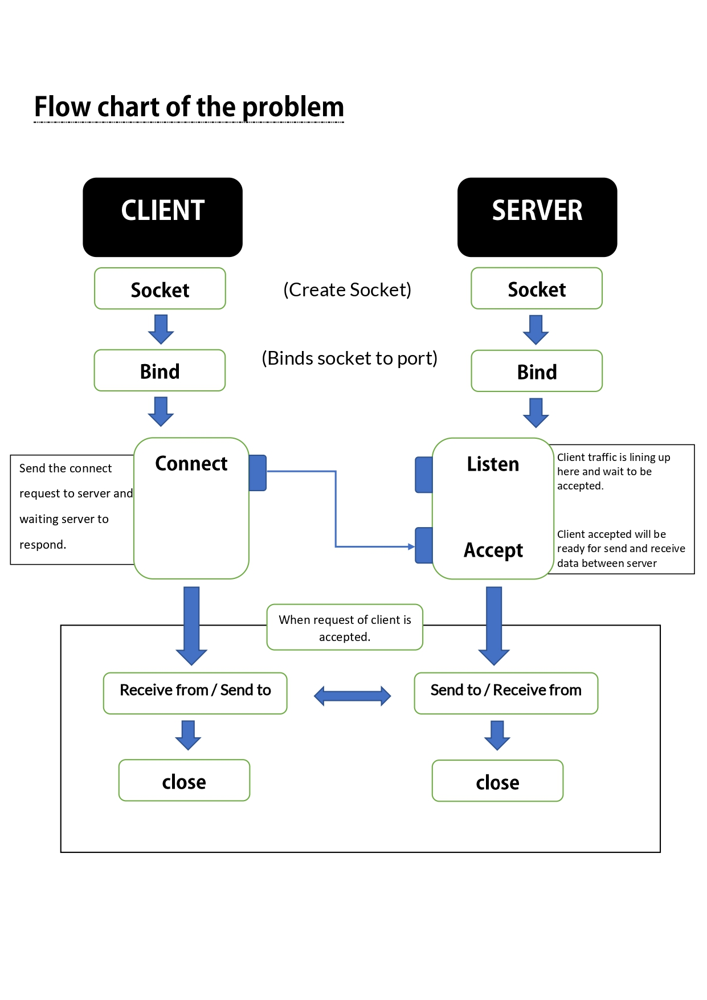
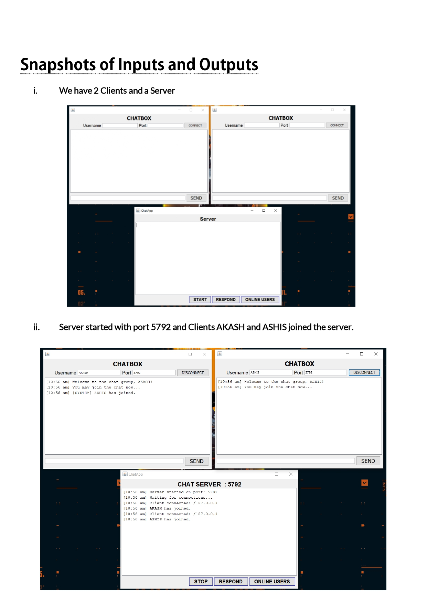
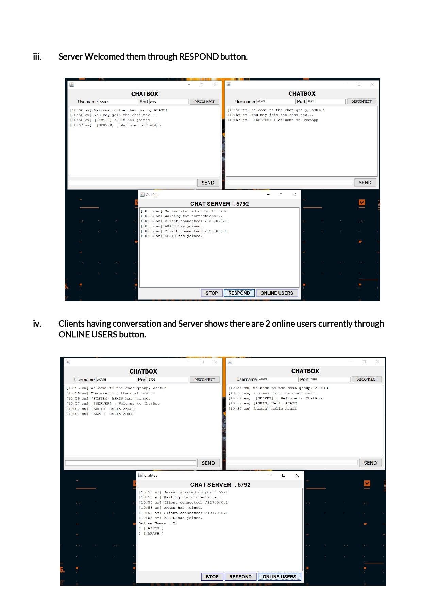
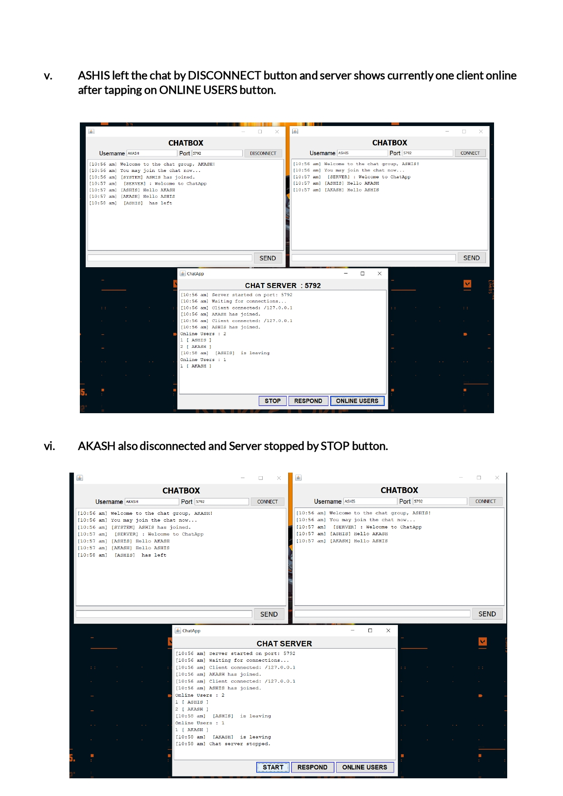

# Chat-Application-in-Java
Jara Network Programming

<h3>GUI based Chatting Application</h3>

It is an implementation of multithreaded server. 
It accepts connections from an arbitrary number of clients; any message sent 
from one client is broadcast to all clients. 
In addition to Server Sockets, it demonstrates the use of threads. Because 
there are interactions among clients, this server needs to keep track of all the 
clients it has at any one time.

<h3>Implementation of Project</h3>

Designed GUI based inte face for client server communication 
Server window contains four buttons (START, STOP, 
RESPOND and ONLINE USERS). The start and stop button to start and stop 
the server, respond button to respond the client and online user will display 
the number of clients connected to the server. 
Client window contains three buttons (CONNECT, 
DISCONNECT, SEND). Connect and disconnect to establish and close 
connection with server. By clicking the send button client will send the 
message. Client windows displays the client names like client1, client2 
etc. The messages gets displayed in the text area. 
Also added more features and customized your chat application to make it 
more user friendly

<h3>Problem Analysis</h3>

A client creates a socket at its end of transmission, and strive to connect the 
socket to server. When a connection is established, server creates a socket at 
its end and, client and server can now readily communicate through writing and 
reading methods. 
1. An object of Server Socket is instantiated, and desired port number is 
specified, on which connection is going to take place. 
2. The accept method of Server Socket is invoked, in order to hold the server in 
listening mode. This method won’t resume until a client is connected to the 
server through the given port number. 
3. Now, on client side, an object of Socket is instantiated, and desired port 
number and IP address is specified for the connection. 
4. An attempt is made, for connecting the client to the server using the specified 
IP address and port number. If attempt is successful, client is provided with 
a Socket that is capable of communicating to the respective server, with write 
and read methods. If unsuccessful, desired exception is raised. 
5. Since a client is connected to the server, accept method on the server side 
resumes, providing a Socket that is capable of communicating to the connected 
client. 
6. Once the communication is completed, terminate the sockets on both, the 
server and the client side. 

<h3>Client-Side Programming:</h3>

For the Client machine, we need to now establish the socket connection. Socket 
Connection is when the two machines have information about each other’s 
network location (IP Address) and the TCP port.

<h3>Server-Side Programming: </h3>

For the server-side programming, a Server Socket is required, that will wait for 
the client in the listening mode, on a particular TCP port. This Server Socket 
holds until a Client Socket is connected successfully. As soon as the client is 
connected, another Socket comes to the existence that will enable data sharing 
between the respective client and server. A temporary Socket is created to 
handle the request from that particular client and our main server socket will 
be free again, to listen to other requests. Hence, we have Server Socket and 
Socket on the server side

<strong>*Server is listening on port: 5792 </strong>is the proof of concept that, once the request 
is arrived, the server diverts it onto another thread and gets ready for listening 
to another request. And extracting and processing the data takes place on 
another thread in parallel.

<h3>Flow Chart</h3>

<h3>SnapShots</h3>

